# Getting Started with Create React App

This project was bootstrapped with [Create React App](https://github.com/facebook/create-react-app).

<a href="https://login-task-react-app.vercel.app/" target="_blank">Live Project</a>

Bu projede kullanılan teknolojiler:

<ul>
<li>react: "18.2.0"</li>
<li>tailwindcss: "3.2.7"</li>
<li>firebase: "9.17.1"</li>
<li>react-router-dom: "6.8.1"</li>
<li>daisyui: "2.50.2"</li>
<li>react-hot-toast: "2.4.0"</li>
</ul>

<h2>1-Login Sayfası</h2>

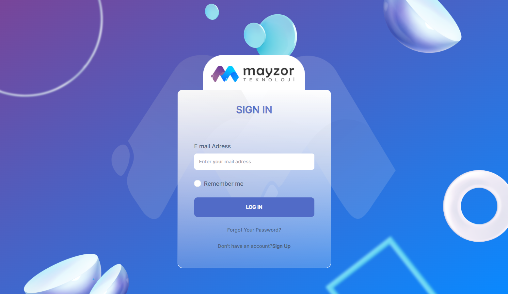
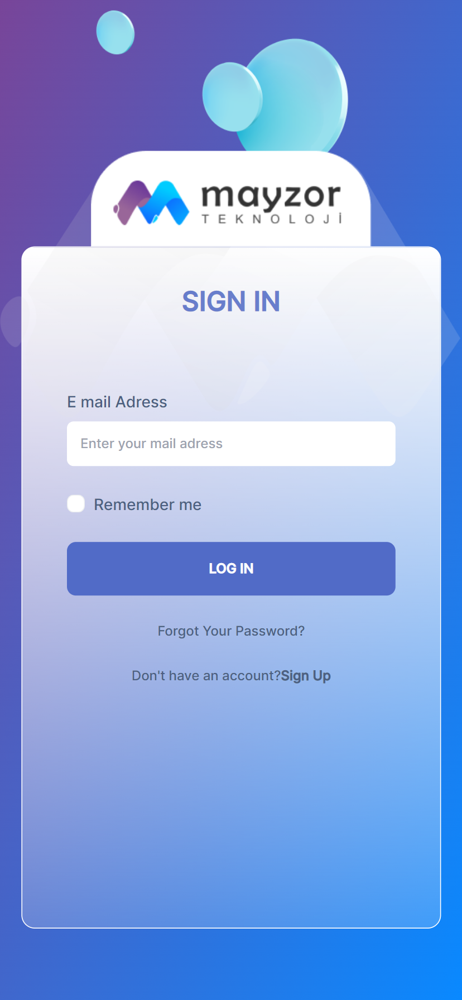

Giriş sayfasında, basit bir şekilde e-mail adresinizi yazarak, uygulamaya giriş yapabilirsiniz. E-mailinizin formata uygun olmaması durumunda, ekranın sağ üst kısmında react-hot-toast hata mesajı verir. Geçerli e-mail girmeniz durumunda, yine sağ üstte "giriş başarılı" uyarısı ile ilk sayfaya yönlendirilirsiniz. 

<h2>2-İlk Sayfa</h2>

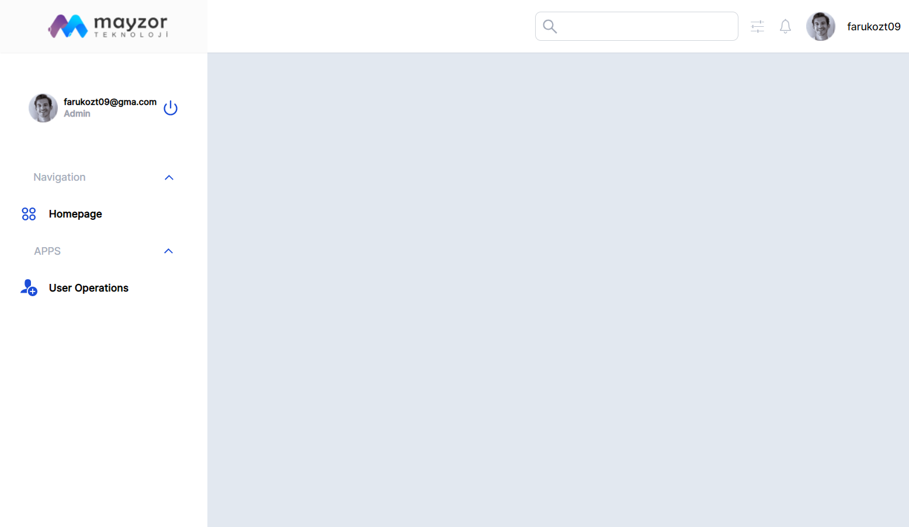
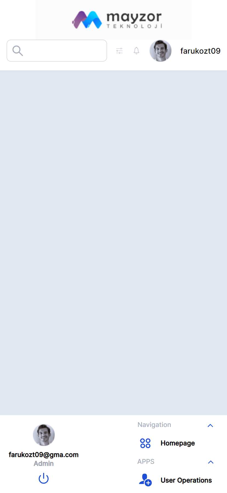

İlk sayfa kısmında, panelimiz boş bulunuyor. Giriş kısmında yazdığınız mail adresi burada gözükür. Cihazınıza göre solda ya da ekranın altında bulunan menüden, ana sayfaya gidebilir veya kullanıcı paneline erişebilirsiniz. "Güç kapatma" tuşuna tıklayarak ise, "çıkış başarılı" uyarısını alıp, giriş sayfasına geri dönebilirsiniz.  

<h2>3-Ana Sayfa</h2>

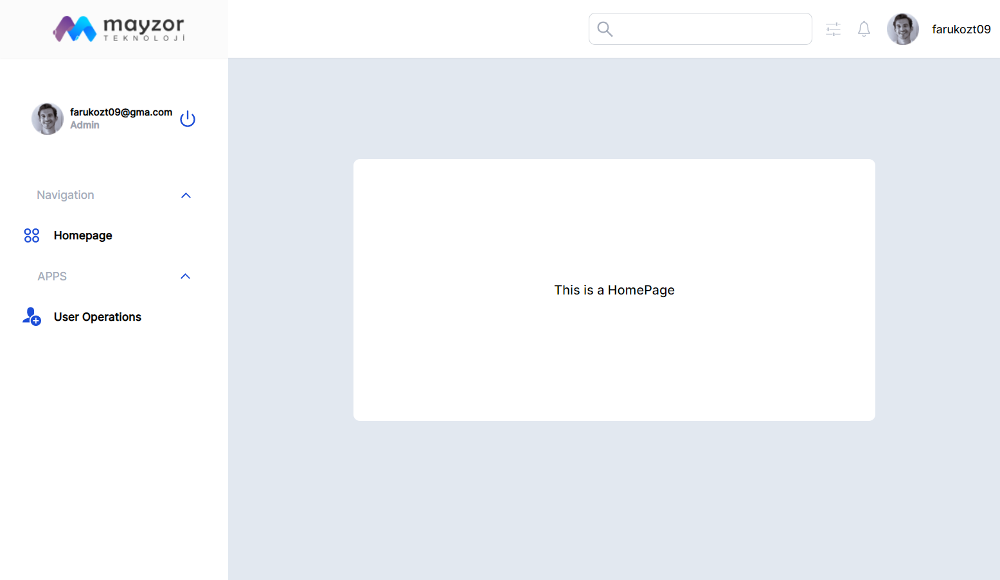
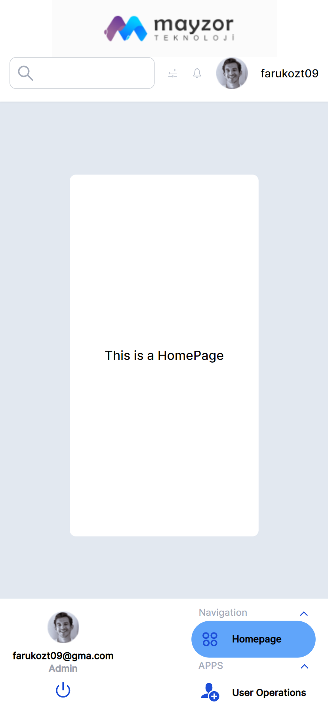

Ana sayfamızda istenildiği üzere sadece ana sayfa olduğunu belirten bir panel bulunuyor. 

<h2>4-Kullanıcı Paneli</h2>

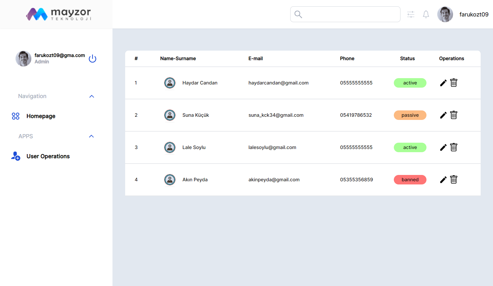
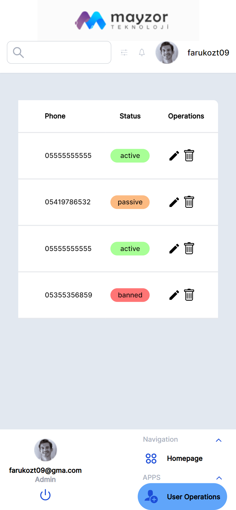

Kullanıcı işlemleri sekmesinde ise, kullanıcı panelini görüntüleyebilir. Kayıtlı kullanıcıların "İsim-Soyisim, e-mail, tel. no, durum bilgisi" bilgilerine ulaşabilirsiniz. İşlemler kısmından "çöp kutusu" simgesi ile kullanıcıyı silebilir veya "düzenleme" simgesi ile kullanıcıyı düzenleyebileceğiniz "Kullanıcı Düzenleme Paneline" yönlenebilirsiniz.

<h2>5-Kullanıcı Düzenleme Paneli</h2>

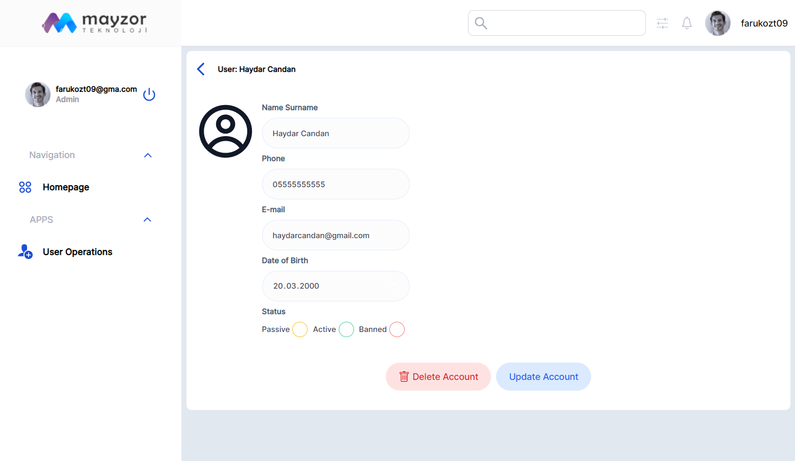
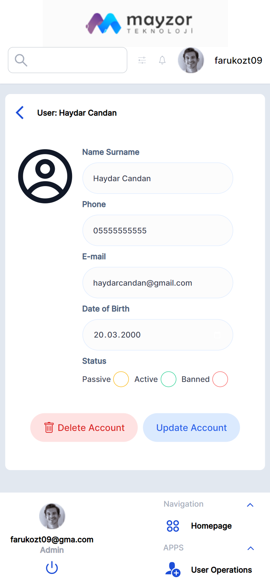

Kullanıcı düzenleme panelinden, seçtiğiniz kullanıcının bilgilerini güncelleyebilir, veya kullanıcıyı silebilirsiniz. 

<h2>6-Sayfa Bulunamadı Uyarısı</h2>

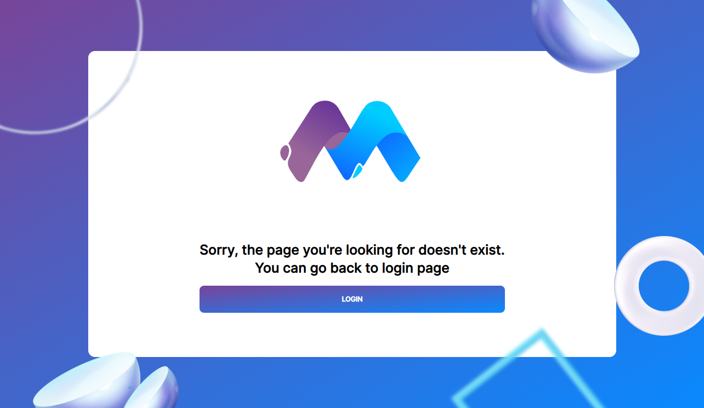
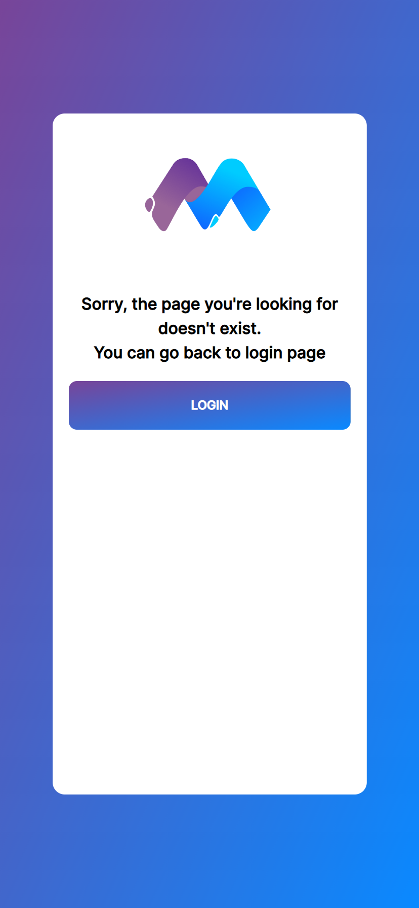

Tarayıcınızın adres kısmından, eksik veya hatalı bir adres girmeniz durumunda, "Sayfa Bulunamadı" uyarısına yönlendirilirsiniz. Buradan tekrar giriş sayfasına dönebilirsiniz. 

## Available Scripts

In the project directory, you can run:

### `npm start`

Runs the app in the development mode.\
Open [http://localhost:3000](http://localhost:3000) to view it in your browser.

The page will reload when you make changes.\
You may also see any lint errors in the console.

### `npm test`

Launches the test runner in the interactive watch mode.\
See the section about [running tests](https://facebook.github.io/create-react-app/docs/running-tests) for more information.

### `npm run build`

Builds the app for production to the `build` folder.\
It correctly bundles React in production mode and optimizes the build for the best performance.

The build is minified and the filenames include the hashes.\
Your app is ready to be deployed!

See the section about [deployment](https://facebook.github.io/create-react-app/docs/deployment) for more information.

### `npm run eject`

**Note: this is a one-way operation. Once you `eject`, you can't go back!**

If you aren't satisfied with the build tool and configuration choices, you can `eject` at any time. This command will remove the single build dependency from your project.

Instead, it will copy all the configuration files and the transitive dependencies (webpack, Babel, ESLint, etc) right into your project so you have full control over them. All of the commands except `eject` will still work, but they will point to the copied scripts so you can tweak them. At this point you're on your own.

You don't have to ever use `eject`. The curated feature set is suitable for small and middle deployments, and you shouldn't feel obligated to use this feature. However we understand that this tool wouldn't be useful if you couldn't customize it when you are ready for it.

## Learn More

You can learn more in the [Create React App documentation](https://facebook.github.io/create-react-app/docs/getting-started).

To learn React, check out the [React documentation](https://reactjs.org/).

### Code Splitting

This section has moved here: [https://facebook.github.io/create-react-app/docs/code-splitting](https://facebook.github.io/create-react-app/docs/code-splitting)

### Analyzing the Bundle Size

This section has moved here: [https://facebook.github.io/create-react-app/docs/analyzing-the-bundle-size](https://facebook.github.io/create-react-app/docs/analyzing-the-bundle-size)

### Making a Progressive Web App

This section has moved here: [https://facebook.github.io/create-react-app/docs/making-a-progressive-web-app](https://facebook.github.io/create-react-app/docs/making-a-progressive-web-app)

### Advanced Configuration

This section has moved here: [https://facebook.github.io/create-react-app/docs/advanced-configuration](https://facebook.github.io/create-react-app/docs/advanced-configuration)

### Deployment

This section has moved here: [https://facebook.github.io/create-react-app/docs/deployment](https://facebook.github.io/create-react-app/docs/deployment)

### `npm run build` fails to minify

This section has moved here: [https://facebook.github.io/create-react-app/docs/troubleshooting#npm-run-build-fails-to-minify](https://facebook.github.io/create-react-app/docs/troubleshooting#npm-run-build-fails-to-minify)
